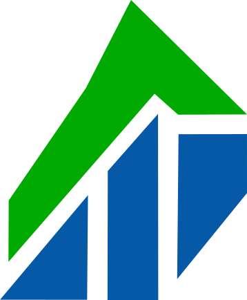
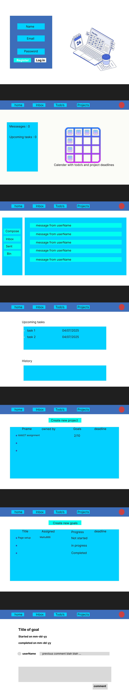

#  GoalGetter

## Description

A platform to keep track of project milestones, deadlines and todolists.

## Color pallet

Primary: #3d6cb9
Secondary: #00d1ff
Accent: #00fff0
Text: #fafaf6

## Example pictures

## Features

* Calendar view
* Todolist view
* Project view
* Journal view (perosnal/project)

* Create shared projects
* Assign tasks to users
* Chat with project partners
* comment on milestones

## Frontend

* React
* Tailwind CSS

## Backend

* Firebase?

## prototype

## Milestones

### Milestone 1

* Dashboard with Calendar view
* Todolist view
* Projects View
* Goal view
* Journal view

### Milestone 2

* Defined database
* Firebase integration
* Firebase Authentication
* Firebase Database

### Milestone 3

* Integrate database with views
* Chat integration

### Milestone 4

* Fine tuning
* Project Cleanup
* Bug fixing

## Timeline

| Milestone |  Weeks |Deadline |
| -------------- | --------------- | --------------- |
| Milestone 1 | 17,18 | 25 April |
| Milestone 2 |19,20| 8 May |
| Milestone 3 |21,22| 23 May |
| Milestone 4 |23| 6 June |
